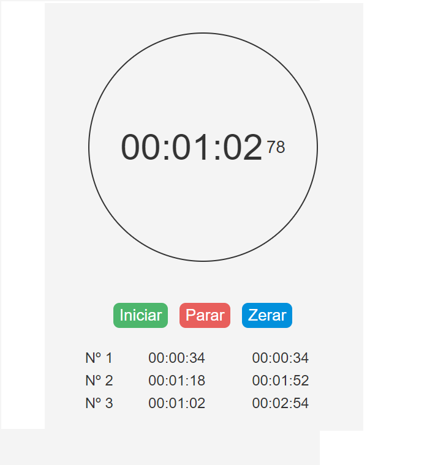

# Cronometro

## 📖 Introdução 

Este é um projeto de estudo prático em JavaScript, utilizando DOM para a criação de uma aplicação que gera um cronometro. Projeto desenvolvido utilizando HTML, CSS e Javascript.

## 🔗Link de Acesso
- Deploy: 

## 👥Equipe
| [<br><sub>Daniel Emidio</sub>](https://github.com/DanielEmidio1988) |
| :---: |

## 🧭Status do Projeto
- ⏳Concluído

## 📄Concepção do Projeto

### Layout

| <br><sub>Home Page</sub> | 
| :---: |

### Funcionalidades
```bash
- Ao clicar em 'Iniciar', o cronometro começara a contagem;
- Ao clicar em 'Parar', o cronometro zera e será exibido ao usuário, abaixo do cronometro, a contagem total do cronometro e a contagem atual;
- Ao clicar em 'Zerar', o cronometro será reiniciado;
```

## 💡Programas utilizados:
- VSCode

## 💻Tecnologias 


## 📫 Contato

E-mail: emidio.daniel@hotmail.com